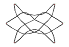

# StringFigures

This code attempts to implement the string figure calculus in Storer's monograph:

Storer, Thomas F. String-figures. Math Department, University of Michigan, 1999

[](https://github.com/abraunst/StringFigures.jl/actions/workflows/CI.yml?query=branch%3Amain)



$`{{OA}}~::~{{{\overset{\longrightarrow}{1}\left(\underline{2f}\right)}}}\# {{{\overset{\longleftarrow}{2}\left(u1n\right):\underset{\longleftarrow}{2}\left(\underline{ℓ1f}\right)}}}\# {{{\square 1}}}{{{|}}} {{{\overset{\longrightarrow}{1}\left(ℓ2f\right):\underset{\longrightarrow}{1}\left(\underline{5f}\right)}}}\# {{{\square 5}}}{{{|}}} {{{\overset{\longleftarrow}{5}\left(\underline{u2n}\right)}}}\# {{{\square u2}}}{{{|}}}`$

Brochos (sling): Storer, Fig. 17, pag. 30

## Quick Start

First, install Julia (e.g. from [juliaup](https://github.com/JuliaLang/juliaup)) and clone this repository.

Inside the repo, open the Julia REPL with `julia`, then press `]` to enter pkg mode.

In pkg mode, set the primary environment to this project:

```text
activate .
```

Then, precompile the project (after installing dependencies):

```text
precompile
```

To run tests in [test/runtests.jl](./test/runtests.jl):

```text
test StringFigures
```

Create and plot a simple figure. Paste the following into a jupyter notebook cell and execute it.

```julia
using StringFigures
OA = proc"OA::DR2"
println(OA[end])
plot(OA)
```

## StringFigure Grammar

Input of Nodes, Linear sequences, Calculus, and full Procedures is specified by a PEG using the `PEG.jl` library. The full grammar is shown below.

* `SeqNode`s (`node.jl`). A sequence node is either a `FrameNode` (i.e. a finger, or a loop in a finger), or a `CrossNode`, i.e. a crossing in the 2D representation of the 3D string figure. Example: `node"L1"`, representing the left thumb.

  ```julia
  @rule int =  r"\d+"
  @rule fnode = r"[LR]" & int & ("." & int)[0:1]
  @rule xnode = "x" & int & "(" & r"[0U]" & ")"
  @rule snode = fnode, xnode
  ```

* `LinearSequence` (`linearsequence.jl`). A linear sequence is a 2D layout of a string figure. It is a sequence of `SeqNode`s, so that following the string you encounter, sequentially, each node in the `LinearSequence`. `CrossNode`s appear in pairs, e.g. `x10(0)` and `x10(U)`, meaning respectively that one goes on the upper string and the lower string in the crossing. Example: `seq"L1:x1(0):R2:x2(0):L5:R5:x2(U):L2:x1(U):R1"` which is Opening A, i.e. OA. You can also graphically display a linear sequence with the function `plot`.

  ```julia
  @rule snodec = snode & ":"
  @rule linseq = (snodec[*] & snode)
  ```

* Some standard openings have been already defined, and can be retrieved with `open"O0", open"O1", open"OA"`.

  ```julia
  @rule opening = r"[0-9A-Za-z]*"p
  ```

* A functor is the finger executing an action. A functor may be lateral or bilateral, the latter meaning that symmetric fingers in both hands will be executing the same action.

  ```julia
  @rule ffun = r"[LR]?" & int
  ```

* A `FrameRef` is a reference to one string attached to a `FrameNode`. `l`,`m`,`u` denote respectively the lowest, middle or top string on it. If there are more than 3 strings, then the second, third, etc are refered to as `m1`, `m2`, ...

  ```julia
  @rule fref = r"l|u|m[1-9]?|" & r"[RL]?" & r"[0-9]"
  ```

* `Passage`s (`passage.jl`). A passage is one coordinated movement of the finger(s), which modifies the figure in some way. E.g. `pass"DL1"`, releasing all strings on the left thumb.

  ```julia
  @rule passage = extend_p, twist_p, release_p, navaho_p, multi_pick_p, pick_p
  @rule extend_p = "|" & r"!*"p
  @rule pick_p = ffun & r"[ou]"p & r"a?"p & r"t?"p & r"\("p & fref & r"[fn]"p & ")"
  @rule pick_pp = pick_p & r":"p
  @rule multi_pick_p = pick_pp[1:end] & pick_p
  @rule release_p = "D" & fref
  @rule navaho_p = "N" & ffun
  @rule twist_p = r"(>+)|(<+)"p & fref
  ```

* `Calculus`s (`calculus.jl`). A `Calculus` is a sequence of `Passage`s, specifying a multi-step transformation of a `LinearSequence`. E.g. `calc"DL1#DL2"`, releasing all strings on both thumbs.

  ```julia
  @rule passages = (passage & r"#?"p)
  @rule calculus = r""p & passages[*]
  ```
  
* `StringProcedure` (`calculus.jl`). A `StringProcedure` is a starting position plus a `Calculus`. Example: `OA::DL2#DR2#|` which goes back to Opening 1 from Opening A. You can plot a `StringProcedure` with the function plot, which plots all intermediate positions.

  ```julia
  @rule parenseq = "(" & linseq & ")"
  @rule procedure = ((parenseq,opening) & r"::"p & calculus)
  ```

## Progress

### Linear sequences

* [x] Structure for linear sequences (Storer, p006)
* [x] Canonical form
  * Conventions seq. 1 and seq. 2 (Storer, p006)
  * Convert to canonical form (Storer, p357-359)

### Visualization

* [x] Elementary visualization (no crossings)
* [x] Crossings visualization
* [x] Only plot active frame nodes
* [x] Multi-loop framenodes
* [ ] Better layout, better string physics?

### Calculus

* [x] Release, i.e. the $\square$ operation (Storer, p023)
  * Calculus (Storer, p362)
* [x] Extend, i.e. the $\mid$ operation (Storer, p003)
  * Lemma 2 A. and B. (Storer, p011) on extension cancellation
* [X] Extension cancellation, $\phi_3$ rule and heuristics to decide when to apply it
* [x] Pick string on the same hand (Storer, p015) or opposite hand (Storer, p020) from below. Example: $\overset{\longleftarrow}{L3}\left(\underline{L1n}\right)$
  * i.e. pass $L3$ (toward the executer) **over** all intermediate strings and pick up $L1n$ from below
  * This is encoded in plain text as `L3o(L1n)`
* [X] Twist and multi-twist moves
* [X] Pick from above (pick + twist)
* [X] Three-dimensional picks, in which the finger moves also vertically to pass over some strings and below others (notation: e.g. `L1o(L2n):L1u(L2f):L1u(L3n)`)
* [X] Navaho release move
* [X] Power Passage (i.e. [::Calculus]^k)
* [x] Multiple loops in a single Ln or Rn
* [x] u,l,m,mx notation
* [x] Pick from non-empty framenode
* [x] Syntactic sugar for passages
* [x] Elementary `StringCalculus`s
* [x] LaTeX output of `StringCalculus`
* [x] `StringProcedures`
* [ ] Non-finger functors
