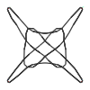

# StringFigures

This code attempts to implement the string figure calculus in Storer's monograph:

Storer, Thomas F. String-figures. Math Department, University of Michigan, 1999

[](https://github.com/abraunst/StringFigures.jl/actions/workflows/CI.yml?query=branch%3Amain)
[](https://abraunst.github.io/StringFigures.jl)



$`{{OA}}~::~{{{\overset{\longrightarrow}{1}\left(\underline{2f}\right)}}}\# {{{\overset{\longleftarrow}{2}\left(u1n\right):\underset{\longleftarrow}{2}\left(\underline{ℓ1f}\right)}}}\# {{{□ 1}}}{{{|}}} {{{\overset{\longrightarrow}{1}\left(ℓ2f\right):\underset{\longrightarrow}{1}\left(\underline{5f}\right)}}}\# {{{□ 5}}}{{{|}}} {{{\overset{\longleftarrow}{5}\left(\underline{u2n}\right)}}}\# {{{□ u2}}}{{{|}}}{{{□ 2}}}{{{|}}}`$

Brochos (sling): Storer, Fig. 17, pag. 30

## Quick Start

First, install Julia (e.g. from [juliaup](https://github.com/JuliaLang/juliaup))

Open the Julia REPL with `julia`.

Add the `StringFigures` package:

```julia
julia> import Pkg; Pkg.add("https://github.com/abraunst/StringFigures.jl")
```

To run tests in [test/runtests.jl](./test/runtests.jl):

```julia
julia> Pkg.test("StringFigures")
```

To create and plot a simple figure in a jupyter notebook, paste the following into a cell and execute it:

```julia
using StringFigures
OA = proc"OA::DR2"
println(OA[end])
plot(OA)
```

## Progress

### Linear sequences

* [x] Structure for linear sequences (Storer, p006)
* [x] Canonical form
  * Conventions seq. 1 and seq. 2 (Storer, p006)
  * Convert to canonical form (Storer, p357-359)

### Visualization

* [x] Elementary visualization (no crossings)
* [x] Crossings visualization
* [x] Only plot active frame nodes
* [x] Multi-loop framenodes
* [ ] Better layout, better string physics?

### Calculus

* [x] Release, i.e. the $□$ operation (Storer, p023)
  * Calculus (Storer, p362)
* [x] Extend, i.e. the $\mid$ operation (Storer, p003)
  * Lemma 2 A. and B. (Storer, p011) on extension cancellation
* [X] Extension cancellation, $\phi_3$ rule and heuristics to decide when to apply it
* [x] Pick string on the same hand (Storer, p015) or opposite hand (Storer, p020) from below. Example: $\overset{\longleftarrow}{L3}\left(\underline{L1n}\right)$
  * i.e. pass $L3$ (toward the executer) **over** all intermediate strings and pick up $L1n$ from below
  * This is encoded in plain text as `L3o(L1n)`
* [X] Twist and multi-twist moves
* [X] Pick from above (pick + twist)
* [X] Three-dimensional picks, in which the finger moves also vertically to pass over some strings and below others (notation: e.g. `L1o(L2n):L1u(L2f):L1u(L3n)`)
* [X] Navaho release move
* [X] Power Passage (i.e. [::Calculus]^k)
* [x] Multiple loops in a single Ln or Rn
* [x] u,l,m,mx notation
* [x] Pick from non-empty framenode
* [x] Syntactic sugar for passages
* [x] Elementary `StringCalculus`s
* [x] LaTeX output of `StringCalculus`
* [x] `StringProcedures`
* [ ] Non-finger functors
